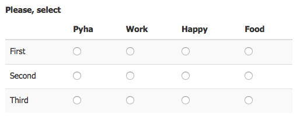

django-radiogrid
================

.. image:: https://codecov.io/gh/Sinkler/django-radiogrid/branch/master/graph/badge.svg
    :target: https://codecov.io/gh/Sinkler/django-radiogrid

.. image:: https://codeclimate.com/github/Sinkler/django-radiogrid/badges/gpa.svg
    :target: https://codeclimate.com/github/Sinkler/django-radiogrid

.. image:: https://img.shields.io/pypi/l/django-radiogrid.svg
    :target: https://pypi.python.org/pypi/django-radiogrid

.. image:: https://img.shields.io/pypi/v/django-radiogrid.svg
    :target: https://pypi.python.org/pypi/django-radiogrid

With this you can create a radio grid field:

Installation
============

::

    pip install django-radiogrid

In your settings.py
-------------------

::

    INSTALLED_APPS = (

        # ...

        'radiogrid',
    )

In your models.py
-----------------

::

    from radiogrid import RadioGridField

    # ...

    ROWS = (
        (1, 'First'),
        (2, 'Second'),
        (3, 'Third'),
    )

    VALUES = (
        ('pyha', 'Pyha'),
        ('work', 'Work'),
        ('happy', 'Happy'),
        ('food', 'Food'),
    )

    class MyModel(models.Model):

        # ...

        my_grid = RadioGridField(rows=ROWS, values=VALUES, require_all_fields=True)

Example project
===============

You can run it as usual:

::

    virtualenv venv
    . venv/bin/activate
    pip install django
    pip install -e .
    cd example
    ./manage.py migrate
    ./manage.py loaddata data
    ./manage.py runserver
    ./manage.py test

or

::

    docker-compose up app
    docker-compose run --rm app test

Developing
==========

Testing
-------

::

    docker-compose run --rm app test
    docker-compose run --rm app coverage
    docker-compose run --rm app tox -e py310-django-master

Releasing
---------

- add a new version description in ``CHANGES.rst``
- change a version in ``__init__.py``
- add a github release
- ``docker-compose run --rm app release``
